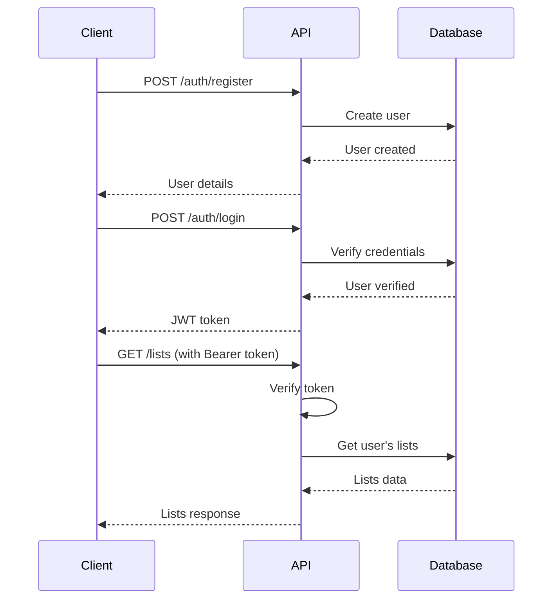

# To-Do List API - Complete Reference

## Overview

This To-Do List API provides a complete solution for managing personal and professional tasks with secure authentication. Built with FastAPI, it offers high performance, automatic API documentation, and robust security features.

## Architecture

```
┌─────────────────┐    ┌─────────────────┐    ┌─────────────────┐
│   Frontend      │    │   FastAPI       │    │   SQLite        │
│   Application   │◄──►│   Backend       │◄──►│   Database      │
└─────────────────┘    └─────────────────┘    └─────────────────┘
                              │
                       ┌─────────────────┐
                       │   JWT Auth      │
                       │   Middleware    │
                       └─────────────────┘
```

## Data Models

### User
```json
{
  "id": 1,
  "username": "john_doe",
  "email": "john@example.com",
  "created_at": "2025-07-14T10:30:00Z"
}
```

### TodoList
```json
{
  "id": 1,
  "title": "Work Tasks",
  "description": "Professional tasks and projects",
  "created_at": "2025-07-14T10:35:00Z",
  "updated_at": "2025-07-14T10:35:00Z",
  "owner_id": 1,
  "tasks": []
}
```

### Task
```json
{
  "id": 1,
  "title": "Complete project proposal",
  "description": "Finish the Q4 project proposal document",
  "completed": false,
  "priority": "high",
  "due_date": "2025-07-20T17:00:00Z",
  "created_at": "2025-07-14T10:40:00Z",
  "updated_at": "2025-07-14T10:40:00Z",
  "list_id": 1
}
```

## Authentication Flow



## Endpoint Reference

### Authentication Endpoints

#### Register User
- **Endpoint**: `POST /auth/register`
- **Authentication**: None required
- **Request Body**:
```json
{
  "username": "john_doe",
  "email": "john@example.com", 
  "password": "securepassword123"
}
```
- **Response**: User object
- **Status Codes**:
  - `200`: Success
  - `400`: Username/email already exists
  - `422`: Validation error

#### Login User
- **Endpoint**: `POST /auth/login`
- **Authentication**: None required
- **Content-Type**: `application/x-www-form-urlencoded`
- **Request Body**:
```
username=john_doe&password=securepassword123
```
- **Response**:
```json
{
  "access_token": "eyJhbGciOiJIUzI1NiIsInR5cCI6IkpXVCJ9...",
  "token_type": "bearer"
}
```

### Lists Endpoints

#### Get All Lists
- **Endpoint**: `GET /lists`
- **Authentication**: Bearer token required
- **Query Parameters**:
  - `skip` (optional): Number of records to skip (default: 0)
  - `limit` (optional): Maximum number of records (default: 100)
- **Response**: Array of TodoList objects

#### Create List
- **Endpoint**: `POST /lists`
- **Authentication**: Bearer token required
- **Request Body**:
```json
{
  "title": "Work Tasks",
  "description": "Professional tasks and projects"
}
```
- **Response**: TodoList object

#### Get List by ID
- **Endpoint**: `GET /lists/{list_id}`
- **Authentication**: Bearer token required
- **Response**: TodoList object with tasks array

#### Update List
- **Endpoint**: `PUT /lists/{list_id}`
- **Authentication**: Bearer token required
- **Request Body**:
```json
{
  "title": "Updated Work Tasks",
  "description": "Updated description"
}
```
- **Response**: Updated TodoList object

#### Delete List
- **Endpoint**: `DELETE /lists/{list_id}`
- **Authentication**: Bearer token required
- **Response**: Success message

### Tasks Endpoints

#### Get Tasks in List
- **Endpoint**: `GET /lists/{list_id}/tasks`
- **Authentication**: Bearer token required
- **Query Parameters**:
  - `skip` (optional): Number of records to skip
  - `limit` (optional): Maximum number of records
- **Response**: Array of Task objects

#### Create Task
- **Endpoint**: `POST /lists/{list_id}/tasks`
- **Authentication**: Bearer token required
- **Request Body**:
```json
{
  "title": "Complete project proposal",
  "description": "Finish the Q4 project proposal document",
  "priority": "high",
  "due_date": "2025-07-20T17:00:00Z"
}
```
- **Response**: Task object

#### Get Task by ID
- **Endpoint**: `GET /tasks/{task_id}`
- **Authentication**: Bearer token required
- **Response**: Task object

#### Update Task
- **Endpoint**: `PUT /tasks/{task_id}`
- **Authentication**: Bearer token required
- **Request Body** (all fields optional):
```json
{
  "title": "Updated task title",
  "description": "Updated description",
  "completed": true,
  "priority": "medium",
  "due_date": "2025-07-25T17:00:00Z"
}
```
- **Response**: Updated Task object

#### Delete Task
- **Endpoint**: `DELETE /tasks/{task_id}`
- **Authentication**: Bearer token required
- **Response**: Success message

## Authentication

All endpoints except `/auth/register` and `/auth/login` require authentication using Bearer tokens.

### Headers Required
```
Authorization: Bearer <your_jwt_token>
Content-Type: application/json
```

### Token Expiration
- Default expiration: 30 minutes
- Configurable via `ACCESS_TOKEN_EXPIRE_MINUTES` environment variable

## Error Handling

### Standard HTTP Status Codes
- `200`: Success
- `400`: Bad Request (validation errors)
- `401`: Unauthorized (missing/invalid token)
- `403`: Forbidden (insufficient permissions)
- `404`: Not Found (resource doesn't exist)
- `422`: Unprocessable Entity (invalid data format)
- `500`: Internal Server Error

### Error Response Format
```json
{
  "detail": "Error message description"
}
```

### Validation Error Format
```json
{
  "detail": [
    {
      "loc": ["body", "email"],
      "msg": "field required",
      "type": "value_error.missing"
    }
  ]
}
```

## Rate Limiting

Currently no rate limiting is implemented. For production use, consider implementing rate limiting middleware.

## CORS Configuration

CORS is configured to allow all origins for development. For production, configure specific allowed origins.

## Security Features

### Password Security
- Passwords hashed using bcrypt
- Minimum password requirements enforced
- No password storage in plain text

### JWT Security
- Signed with HS256 algorithm
- Configurable secret key
- Token expiration enforced
- Token validation on every request

### Authorization
- Users can only access their own resources
- Database queries filtered by user ownership
- No access to other users' data

## Development

### Local Development Setup
```bash
# Clone repository
git clone <repository-url>
cd to_do_list

# Setup environment
chmod +x setup.sh
./setup.sh

# Start development server
source venv/bin/activate
uvicorn main:app --reload
```

### Running Tests
```bash
# Install test dependencies
pip install pytest pytest-asyncio httpx

# Run tests
pytest

# Run with coverage
pytest --cov=main
```

### Environment Variables
```env
SECRET_KEY=your-secret-key-here
ALGORITHM=HS256
ACCESS_TOKEN_EXPIRE_MINUTES=30
DATABASE_URL=sqlite:///./todo.db
```

## Production Deployment

### Environment Setup
1. Use a strong, unique `SECRET_KEY`
2. Configure proper database (PostgreSQL recommended)
3. Set up HTTPS/TLS
4. Configure CORS for specific origins
5. Implement rate limiting
6. Set up logging and monitoring

### Docker Deployment
```dockerfile
FROM python:3.11-slim

WORKDIR /app
COPY requirements.txt .
RUN pip install -r requirements.txt

COPY . .
EXPOSE 8000

CMD ["uvicorn", "main:app", "--host", "0.0.0.0", "--port", "8000"]
```

## API Client Examples

### Python Client
```python
import requests

# Login
response = requests.post("http://localhost:8000/auth/login", 
                        data={"username": "user", "password": "pass"})
token = response.json()["access_token"]

# Use API
headers = {"Authorization": f"Bearer {token}"}
lists = requests.get("http://localhost:8000/lists", headers=headers)
```

### JavaScript Client
```javascript
// Login
const loginResponse = await fetch('/auth/login', {
  method: 'POST',
  headers: {'Content-Type': 'application/x-www-form-urlencoded'},
  body: 'username=user&password=pass'
});
const {access_token} = await loginResponse.json();

// Use API
const listsResponse = await fetch('/lists', {
  headers: {'Authorization': `Bearer ${access_token}`}
});
const lists = await listsResponse.json();
```

### cURL Examples
```bash
# Register
curl -X POST "http://localhost:8000/auth/register" \
  -H "Content-Type: application/json" \
  -d '{"username":"user","email":"user@example.com","password":"pass"}'

# Login
curl -X POST "http://localhost:8000/auth/login" \
  -H "Content-Type: application/x-www-form-urlencoded" \
  -d "username=user&password=pass"

# Get lists
curl -X GET "http://localhost:8000/lists" \
  -H "Authorization: Bearer <token>"
```

## Integration with Frontend Frameworks

### React Example
```jsx
import { useState, useEffect } from 'react';

function TodoApp() {
  const [token, setToken] = useState(localStorage.getItem('token'));
  const [lists, setLists] = useState([]);

  useEffect(() => {
    if (token) {
      fetch('/lists', {
        headers: { 'Authorization': `Bearer ${token}` }
      })
      .then(res => res.json())
      .then(setLists);
    }
  }, [token]);

  return (
    <div>
      {lists.map(list => (
        <div key={list.id}>{list.title}</div>
      ))}
    </div>
  );
}
```

### Vue.js Example
```vue
<template>
  <div>
    <div v-for="list in lists" :key="list.id">
      {{ list.title }}
    </div>
  </div>
</template>

<script>
export default {
  data() {
    return { lists: [] };
  },
  async mounted() {
    const token = localStorage.getItem('token');
    if (token) {
      const response = await fetch('/lists', {
        headers: { 'Authorization': `Bearer ${token}` }
      });
      this.lists = await response.json();
    }
  }
};
</script>
```

## Troubleshooting

### Common Issues

1. **401 Unauthorized**
   - Check if token is included in Authorization header
   - Verify token format: `Bearer <token>`
   - Check if token has expired

2. **404 Not Found**
   - Verify endpoint URL is correct
   - Check if resource exists and belongs to authenticated user

3. **422 Validation Error**
   - Check request body format
   - Ensure required fields are provided
   - Verify data types match schema

4. **500 Internal Server Error**
   - Check server logs
   - Verify database connection
   - Check environment variables

### Debug Mode
```bash
# Run with debug logging
uvicorn main:app --reload --log-level debug
```

## Contributing

1. Fork the repository
2. Create a feature branch
3. Make your changes
4. Add tests for new functionality
5. Ensure all tests pass
6. Submit a pull request

## License

This project is licensed under the MIT License - see the LICENSE file for details.
